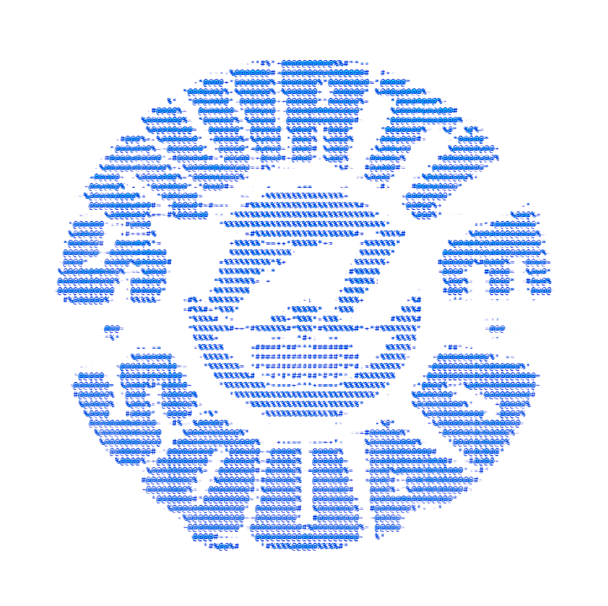

  
  <h1>Rahul A.</h1>
  
<strong>CS Student and AI/ML Enthusiast</strong>

  
Computer Science student at Loyola-ICAM College of Engineering and Technology (LICET), exploring artificial intelligence, machine learning, computer vision, and NLP.

  
  

## About me
Currently, I am studying Computer Science Engineering from LICET and I am actively engaged in discovering and exploring new technologies such as artificial intelligence, machine learning, deep learning, computer vision and natural language processing. Along with academic curriculum, my interest and enthusiasm towards building projects that help me understand these technologies better also add to my learning process.

## Tech stack

<!-- PROFILE_LANGUAGES:START -->
- **HTML** - 55.3% of detected code
- **Python** - 22.8% of detected code
- **JavaScript** - 15.0% of detected code
- **CSS** - 6.9% of detected code
- **Procfile** - 0.0% of detected code
<!-- PROFILE_LANGUAGES:END -->

## Repositories

<!-- PROFILE_REPOSITORIES:START -->
- [**Rahul-A-2111**](https://github.com/Rahul-A-2111/Rahul-A-2111) - No description provided.  
  Language: `HTML` | Stars: 0 | Forks: 0
- [**Lab-Record-Agent**](https://github.com/Rahul-A-2111/Lab-Record-Agent) - An Ai agent to prepare lab records for college work  
  Language: `HTML` | Stars: 0 | Forks: 0
- [**FlyWire-Connectome-Music-Rater**](https://github.com/Rahul-A-2111/FlyWire-Connectome-Music-Rater) - FlyWire Connectome Music Rater is an interactive web application that evaluates audio tracks by simulating fruit fly (Drosophila melanogaster) Johnston's Organ sensory responses and downstream spiking neural dynamics using real connectomic synaptic data from the FlyWire public dataset.  
  Language: `Python` | Stars: 0 | Forks: 0
- [**3D-website-practice**](https://github.com/Rahul-A-2111/3D-website-practice) - Just trying out how to create a 3d website for fun  
  Language: `JavaScript` | Stars: 0 | Forks: 0
- [**Git-practice**](https://github.com/Rahul-A-2111/Git-practice) - For practice  
  Language: `Python` | Stars: 0 | Forks: 0
- [**login-page**](https://github.com/Rahul-A-2111/login-page) - platform to buy and rent refurbsihed products  
  Language: `JavaScript` | Stars: 0 | Forks: 0
<!-- PROFILE_REPOSITORIES:END -->

## SQUIRTLE SQUAD

  

