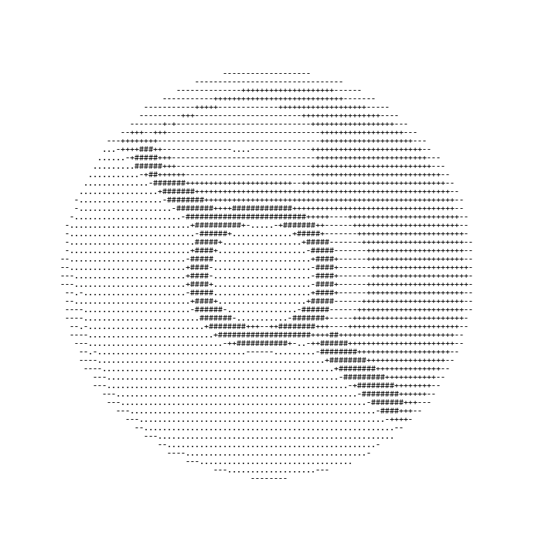

  <!-- Dynamic ASCII Squirtle Avatar (Updated to .gif) -->
  
  
    
  <code>SQUIRTLE_SYS://01001001 • NEURAL-NODE.ONLINE</code>
  
  <h1>Rahul A</h1>
  
<b>Rahul-A-2111</b> | Developer specializing in Python architecture, algorithmic simulations, and neural connectome data processing.

  

    
    
    
  

 

### 📊 Live Telemetry
*(Auto-updating via GitHub API)*

  
  

 

### 🖲️ Matrix Pokéball Arsenal

  <table>
    <tr>
      <!-- Repo 1: FlyWire -->
      <td align="center" width="33%">
         
        <b><a href="https://github.com/Rahul-A-2111/FlyWire-Connectome-Music-Rater">FlyWire-Connectome</a></b> 
        Neural data & audio rating
      </td>
      
      <!-- Repo 2: Template -->
      <td align="center" width="33%">
         
        <b><a href="https://github.com/Rahul-A-2111/YOUR-REPO-2">Python-Simulations</a></b> 
        Algorithmic modeling
      </td>

      <!-- Repo 3: Template -->
      <td align="center" width="33%">
         
        <b><a href="https://github.com/Rahul-A-2111/YOUR-REPO-3">Data-Structures</a></b> 
        C++ algorithms
      </td>
    </tr>
  </table>

 

  

